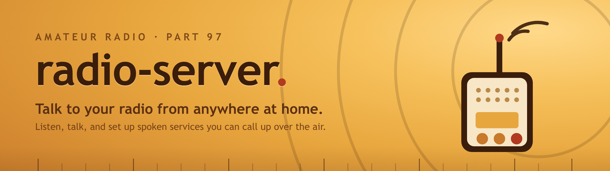

# radio-server

**Turn your ham radio into a doorway to the world.** radio-server connects a small computer to your
radio and bridges it to a Mumble voice server on the internet — so the handheld on your belt can talk
with hams anywhere on Earth, and your web browser can join the same conversation.

It's built to be friendly to set up, and it takes care of the legal basics (like identifying your
station with your callsign) for you.

It even comes pointed at a demo server: get it running, key `1 0 #` on your radio, and you're
talking to the world.

---

## Who is this for?

**Just you.** You like experimenting, you've got a handheld and a spare computer, and you'd like more
people to talk to than the local repeater offers. Point radio-server at any busy Mumble server and
your HT reaches all of them — from the garage, the yard, or the car in the driveway.

**You and your friends.** A few ham friends scattered across the country — no shared repeater, no way
to rag-chew like you used to. Each of you runs radio-server, you all meet on one Mumble server (a
public one at first, or [your own for about $2 a month](docs/mumble-server/)), and the distance
disappears.

**Your radio club.** Members spread out, a repeater that doesn't reach everyone — or no repeater at
all — and DStar, DMR, and Fusion feel like a lot to take on. A club Mumble server plus radio-server
gives everyone a voice channel using nothing but the radios they already own.
[Running your own server](docs/mumble-server/) is easier and cheaper than you'd think.

## What you can do with it

- **Talk to the world from your handheld.** Key a short code and your station links itself to a
  Mumble voice channel: what you say on the radio reaches everyone there, and their voices come back
  over the air. Key another code and the link drops.
- **Talk from your browser.** The control page is part of the conversation too — listen and talk on
  the linked channel with no radio in your hand, or use your browser as a remote mic and speaker for
  the radio itself.
- **Ask your station to speak.** Callers with a handheld can key `0 1 #` to hear the station ID or
  `0 2 #` to hear the time, read aloud back to them — and you can add your own spoken services.
- **Stay legal without thinking about it.** Your station is identified automatically, on schedule, in
  Morse or a spoken voice.
- **Keep an operating log** of what your station has done, and optionally record audio.

Everything works the same whether you're using the built-in practice radio or a real one, so you can
try it all before connecting any equipment.

## What you'll need

- A computer (Windows, macOS, or Linux) on your home network.
- A radio that works with the **[NA6D AIOC cable](https://na6d.com/products/aioc-ham-radio-all-in-one-cable)**
  — a small USB cable that carries the audio and the push-to-talk. The **Baofeng UV-5R** is the tested
  reference. Support for the **Kenwood TM-V71A/E and TM-D710 family** (which share the same control
  system) is planned, and so is the **[KV4P HT](https://www.kv4p.com/)** — an open-source gadget that
  turns your phone into the radio. You can also explore the whole thing with **no radio at all**,
  using the practice mode.
- An amateur radio license to transmit — this is a tool for licensed operators.

---

## Start here

**One command sets it up** and opens on the practice radio, already pointed at the demo server:

**macOS / Linux**
```sh
curl -LsSf https://raw.githubusercontent.com/kbennett2000/radio-server/master/scripts/install.sh | sh
```

**Windows (PowerShell)**
```powershell
irm https://raw.githubusercontent.com/kbennett2000/radio-server/master/scripts/install.ps1 | iex
```

It installs the pieces, builds the control panel, and prints your password and how to start. When
it finishes, run `uv run python -m radio_server` and open `http://127.0.0.1:8000`.

👉 **Prefer to see every step?** [Try it first — no radio needed](docs/getting-started.md) does the
same thing by hand, in about 15 minutes — the best way to understand what's happening before you
connect anything.

When you're ready for the real thing, [Setting it up with your radio](docs/install.md) takes it from
there — and `1 0 #` puts you on the air with the world.

---

## Guides

**Getting started**
- [Try it first — no radio needed](docs/getting-started.md) — see it working in 15 minutes.
- [Setting it up with your radio](docs/install.md) — connect a real radio, step by step.

**Everyday use**
- [Using your station](docs/using-it.md) — the control panel, calling in over the air, and talking
  to the world over the Mumble link.
- [Running your own Mumble server](docs/mumble-server/) — for friend groups and clubs, about
  $2 a month.
- [Changing the settings](docs/configuration.md) — adjust anything, mostly from the browser.
- [Bench setup & troubleshooting](docs/hardware-bringup.md) — set audio levels and fix "I hear
  nothing."

**Under the hood** (for the technically inclined — you don't need these to use radio-server)
- [Operating guide](docs/operating.md) — how login, station ID, logging, and security work in detail.
- [Running it as an always-on server](docs/deployment.md) — leave it running unattended on a Linux box.
- [The browser control panel](web/README.md) — building and developing the web page.
- [How it's built](docs/architecture.md) and [the API reference](docs/api.md) — for developers.

---

## A note on privacy

Everything sent over amateur radio is in the open — that's normal, and radio-server doesn't change it.
While your station is linked, what's said on the radio also reaches the internet voice channel, and
what's said there goes out over the air. The login code isn't there to keep things secret; it's there
so only you can use your station's services. See
[Using your station](docs/using-it.md#a-note-on-privacy-nothing-over-the-air-is-secret) for the
plain-English version.

## Building on it

radio-server is a Python project. If you'd like to develop it, add a spoken service of your own (they
plug in from a folder — no need to touch the code), or add a backend for a new radio, see
[AGENTS.md](AGENTS.md) and [How it's built](docs/architecture.md). The whole test suite runs against
the practice radio, so you need no hardware to work on it:

```sh
uv run pytest
```
